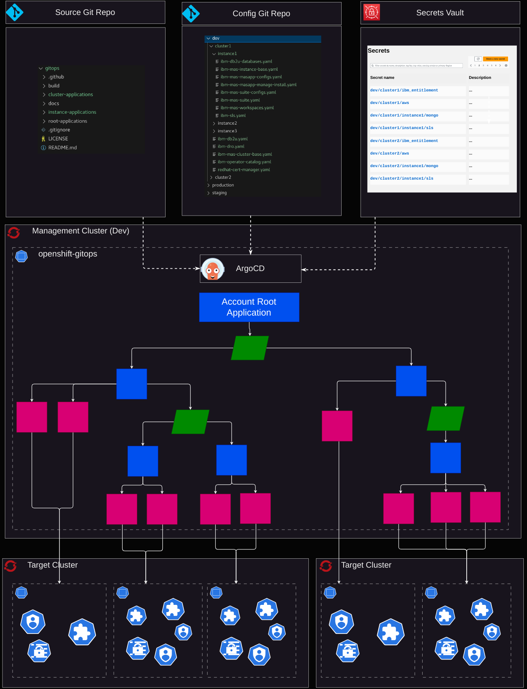
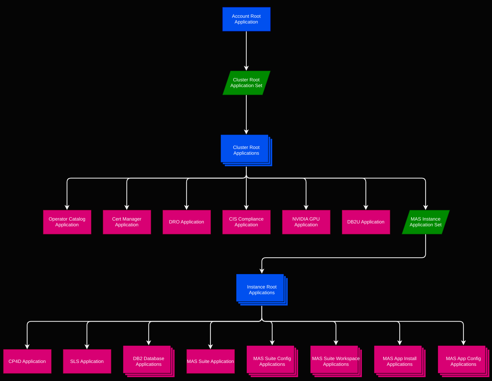

# gitops

A GitOps approach to managing Maximo Application Suite.

## Table of Contents
> TODO: make these links
- Architecture
- Application Structure
- Config Git Repository Structure
- Application and ApplicationSet Details
- Deployment Orchestration

## Architecture



The **Source Git Repo** provides Helm Charts that define all of the Kubernetes resources required to deploy MAS instances using ArgoCD. The [ibm-mas/gitops](https://github.com/ibm-mas/gitops/tree/demo2) repository can be used directly as the **Source Git Repo**, or a fork can be used if desired.

The **Config Git Repo** provides configuration YAML files that define the Values for rendering the Helm Charts in the **Source Git Repo**. The  **Config Git Repo** defines how many MAS instances will be deployed and where and how each of the MAS instances are configured. Each top-level folder contains the config for one **Account** (e.g. "dev", "staging", "production"). Each **Account**  has a subfolder per **Target Cluster**. And each **Target Cluster** has a subfolder per **MAS Instance** that should run on that cluster.

The **Secrets Vault** is used to store sensitive values that should not be exposed in the **Source Git Repo**. They are fetched at runtime using the [ArgoCD Vault Plugin](https://argocd-vault-plugin.readthedocs.io/en/stable/) from some backend implementation (e.g. AWS Secrets Manager). 

ArgoCD is installed and configured on some **Management Cluster**. A single **Account Root Application** is registered with ArgoCD. This tells ArgoCD how to access the **Source Git Repo**, **Config Git Repo** and **Secrets Vault** and which **Account ID** (i.e. which top-level folder of the **Config Git Repo**)  to monitor for configuration files. 

The **Account Root Application** is the only Application that is created directly. We employ the [App of Apps pattern](https://argo-cd.readthedocs.io/en/stable/operator-manual/cluster-bootstrapping/#app-of-apps-pattern) whereby the **Account Root Application** uses the artifacts in the **Source Git Repo**, **Config Git Repo** and **Secrets Vault** to dynamically generate (a tree of) further Applications (and ApplicationSets) which themselves may generate other Applications (and ApplicationSets) and/or configure a set of resources on one of the **Target Clusters**.


## Application Structure


The following figure shows the generated tree of ArgoCD applications and ApplicationSets, starting with the **Account Root Application** at the top:




The **Account Root Application** [Helm Chart]((https://github.com/ibm-mas/gitops/tree/demo2/root-applications/ibm-mas-account-root)) installs the **[Cluster Root Application Set](https://github.com/ibm-mas/gitops/tree/demo2/root-applications/ibm-mas-account-root/templates/000-cluster-appset.yaml)**. This generates a set of **MAS Cluster Root Applications** based on the configuration in the **Config Git Repo*. 

The **Cluster Root Application** [Helm Chart](https://github.com/ibm-mas/gitops/tree/demo2/root-applications/ibm-mas-cluster-root) contains templates that generate ArgoCD Applications for configuring various dependencies shared by MAS instances on the target cluster, including:

- [Operator Catalog](https://github.com/ibm-mas/gitops/blob/demo2/root-applications/ibm-mas-cluster-root/templates/000-ibm-operator-catalog-app.yaml) ([Helm Chart](https://github.com/ibm-mas/gitops/blob/demo2/cluster-applications/))
- [Redhat Certificate Manager](https://github.com/ibm-mas/gitops/blob/demo2/root-applications/ibm-mas-cluster-root/templates/010-ibm-redhat-cert-manager-app.yaml) ([Helm Chart](https://github.com/ibm-mas/gitops/blob/demo2/cluster-applications/010-redhat-cert-manager))
- [DRO](https://github.com/ibm-mas/gitops/blob/demo2/root-applications/ibm-mas-cluster-root/templates/010-ibm-dro-app.yaml) ([Helm Chart](https://github.com/ibm-mas/gitops/blob/demo2/cluster-applications/020-ibm-dro))
- [Db2u Operator](https://github.com/ibm-mas/gitops/blob/demo2/root-applications/ibm-mas-cluster-root/templates/020-ibm-db2u-app.yaml) ([Helm Chart](https://github.com/ibm-mas/gitops/blob/demo2/cluster-applications/060-ibm-db2u))
- [CIS Compliance](https://github.com/ibm-mas/gitops/blob/demo2/root-applications/ibm-mas-cluster-root/templates/040-cis-compliance-app.yaml) ([Helm Chart](https://github.com/ibm-mas/gitops/blob/demo2/cluster-applications/040-cis-compliance))
- [Nvidia GPU Operator](https://github.com/ibm-mas/gitops/blob/demo2/root-applications/ibm-mas-cluster-root/templates/050-nvidia-gpu-operator-app) ([Helm Chart](https://github.com/ibm-mas/gitops/blob/demo2/cluster-applications/050-nvidia-gpu-operator))


The **Cluster Root Application** [Helm Chart](https://github.com/ibm-mas/gitops/tree/demo2/root-applications/ibm-mas-cluster-root) also installs the **[MAS Instance Root Application Set](https://github.com/ibm-mas/gitops/blob/demo2/root-applications/ibm-mas-cluster-root/templates/099-instance-appset.yaml)**. This generates a set of **MAS Instance Root Applications** based on the configuration in the **Config Git Repo**.  

The **MAS Instance Root Application** [Helm Chart](https://github.com/ibm-mas/gitops/tree/demo2/root-applications/ibm-mas-instance-root) contains templates for generating ArgoCD Applications that install and configure some instance-level dependencies (e.g. SLS, DB2 Databases), MAS Core and various (MAS) applications (e.g. Manage, Monitor, etc) in the appropriate namespace on the target cluster:
 
- [CP4D](https://github.com/ibm-mas/gitops/blob/demo2/root-applications/ibm-mas-instance-root/templates/080-ibm-cp4d.yaml) ([Helm Chart](https://github.com/ibm-mas/gitops/blob/demo2/instance-applications/080-ibm-cp4d))
- [SLS (Suite License Service)](https://github.com/ibm-mas/gitops/blob/demo2/root-applications/ibm-mas-instance-root/templates/100-ibm-sls-app.yaml) ([Helm Chart](https://github.com/ibm-mas/gitops/blob/demo2/instance-applications/100-ibm-sls))
- [MAS Suite](https://github.com/ibm-mas/gitops/blob/demo2/root-applications/ibm-mas-instance-root/templates/130-ibm-mas-suite-app.yaml) ([Helm Chart](https://github.com/ibm-mas/gitops/blob/demo2/instance-applications/130-ibm-mas-suite))
- [MAS App Assist Install](https://github.com/ibm-mas/gitops/blob/demo2/root-applications/ibm-mas-instance-root/templates/500-ibm-mas-masapp-assist-install.yaml) ([Helm Chart](https://github.com/ibm-mas/gitops/blob/demo2/instance-applications/500-540-ibm-mas-suite-app-install))
- [MAS App IoT Install](https://github.com/ibm-mas/gitops/blob/demo2/root-applications/ibm-mas-instance-root/templates/500-ibm-mas-masapp-iot-install.yaml) ([Helm Chart](https://github.com/ibm-mas/gitops/blob/demo2/instance-applications/500-540-ibm-mas-suite-app-install))
- [MAS App Manage Install](https://github.com/ibm-mas/gitops/blob/demo2/root-applications/ibm-mas-instance-root/templates/500-ibm-mas-masapp-manage-install.yaml) ([Helm Chart](https://github.com/ibm-mas/gitops/blob/demo2/instance-applications/500-540-ibm-mas-suite-app-install))
- [MAS App VisualInspection Install](https://github.com/ibm-mas/gitops/blob/demo2/root-applications/ibm-mas-instance-root/templates/500-ibm-mas-masapp-visualinspection-install.yaml) ([Helm Chart](https://github.com/ibm-mas/gitops/blob/demo2/instance-applications/500-540-ibm-mas-suite-app-install))
- [MAS App Health Install](https://github.com/ibm-mas/gitops/blob/demo2/root-applications/ibm-mas-instance-root/templates/520-ibm-mas-masapp-health-install.yaml) ([Helm Chart](https://github.com/ibm-mas/gitops/blob/demo2/instance-applications/500-540-ibm-mas-suite-app-install))
- [MAS App Monitor Install](https://github.com/ibm-mas/gitops/blob/demo2/root-applications/ibm-mas-instance-root/templates/520-ibm-mas-masapp-monitor-install.yaml) ([Helm Chart](https://github.com/ibm-mas/gitops/blob/demo2/instance-applications/500-540-ibm-mas-suite-app-install))
- [MAS App Optimizer Install](https://github.com/ibm-mas/gitops/blob/demo2/root-applications/ibm-mas-instance-root/templates/520-ibm-mas-masapp-optimizer-install.yaml) ([Helm Chart](https://github.com/ibm-mas/gitops/blob/demo2/instance-applications/500-540-ibm-mas-suite-app-install))
- [MAS App Predict Install](https://github.com/ibm-mas/gitops/blob/demo2/root-applications/ibm-mas-instance-root/templates/540-ibm-mas-masapp-predict-install.yaml) ([Helm Chart](https://github.com/ibm-mas/gitops/blob/demo2/instance-applications/500-540-ibm-mas-suite-app-install))


There are some special templates in the **MAS Instance Root Application** [Helm Chart](https://github.com/ibm-mas/gitops/tree/demo2/root-applications/ibm-mas-instance-root) that are capable of generating multiple Applications; necessary when there may be one or more instances of that type of resource, which will vary between MAS instances - for instance DB2 databases, suite configs, and suite/application workspaces:

- [DB2 Databases](https://github.com/ibm-mas/gitops/blob/demo2/root-applications/ibm-mas-instance-root/templates/120-db2-databases-app.yaml) ([Helm Chart](https://github.com/ibm-mas/gitops/blob/demo2/instance-applications/120-ibm-db2u-database))
- [MAS Workspaces](https://github.com/ibm-mas/gitops/blob/demo2/root-applications/ibm-mas-instance-root/templates/200-ibm-mas-workspaces.yaml) ([Helm Chart](https://github.com/ibm-mas/gitops/blob/demo2/instance-applications/220-ibm-mas-workspace))
- [MAS App Configs](https://github.com/ibm-mas/gitops/blob/demo2/root-applications/ibm-mas-instance-root/templates/510-550-ibm-mas-masapp-configs) ([Helm Chart](https://github.com/ibm-mas/gitops/blob/demo2/instance-applications/510-550-ibm-mas-suite-app-config))
- [Suite Configs](https://github.com/ibm-mas/gitops/blob/demo2/root-applications/ibm-mas-instance-root/templates/130-ibm-mas-suite-configs-app.yaml)
  - This application is responsible for installing various types of suite configuration types (Mongo, BAS, SMTP, etc) at various scopes (system, app, ws, wsapp). The Helm Chart it uses is chosen dynanmically based on the configuration type:
    - [JDBC Config](https://github.com/ibm-mas/gitops/blob/demo2/instance-applications/130-ibm-db2u-jdbc-config)
    - [Kafka Config](https://github.com/ibm-mas/gitops/blob/demo2/instance-applications/130-ibm-kafka-config)
    - [BAS Config](https://github.com/ibm-mas/gitops/blob/demo2/instance-applications/130-ibm-mas-bas-config)
    - [IDP Config](https://github.com/ibm-mas/gitops/blob/demo2/instance-applications/130-ibm-mas-idp-config)
    - [Mongo Config](https://github.com/ibm-mas/gitops/blob/demo2/instance-applications/130-ibm-mas-mongo-config)
    - [SLS Config](https://github.com/ibm-mas/gitops/blob/demo2/instance-applications/130-ibm-mas-sls-config)
    - [SMTP Config](https://github.com/ibm-mas/gitops/blob/demo2/instance-applications/130-ibm-mas-smtp-config)
    - [COS Config](https://github.com/ibm-mas/gitops/blob/demo2/instance-applications/130-ibm-objectstorage-config)

> **Why not use ApplicationSets for dynamic generation of DB2 Database, MAS Workspace, MAS App Config and Suite Config Applications?** We encountered some limitations when using ApplicationSets for this purpose. For instance, Applications generated by ApplicationSets do not participate in the [ArgoCD syncwave](https://argo-cd.readthedocs.io/en/stable/user-guide/sync-waves/) with other Applications so we would have no way of ensuring that resources would be configured in the correct order. Instead, we make use of the Helm `range` control structure in the Helm template to dynamically generate applications that are direct children of the parent application. 

### Config Git Repository Structure

The **Config Git Repo** represents the "source of truth" that (along with the Charts in the **Source Git Repo** and the secrets in the **Secrets Vault**) provides everything ArgoCD needs to install and manage MAS instances across the target clusters. 

The **Config Git Repo** is structured as a hierarchy, with "accounts" (e.g. dev/prod/staging) at the top, followed by "clusters", followed by "instances". Each level contains different types of `.yaml` configuration files. Each `.yaml` file will cause ArgoCD to generate one (or more) application(s), which in turn render Helm charts into the appropriate target cluster.

```
├── <ACCOUNT_ID>
│   └── <CLUSTER_ID>
│       ├── <INSTANCE_ID>
│       │   ├── ibm-db2u-databases.yaml
│       │   ├── ibm-mas-instance-base.yaml
│       │   ├── ibm-mas-masapp-assist-install.yaml
│       │   ├── ibm-mas-masapp-configs.yaml
│       │   ├── ibm-mas-masapp-iot-install.yaml
│       │   ├── ibm-mas-masapp-manage-install.yaml
│       │   ├── ibm-mas-masapp-monitor-install.yaml
│       │   ├── ibm-mas-masapp-optimizer-install.yaml
│       │   ├── ibm-mas-masapp-visualinspection-install.yaml
│       │   ├── ibm-mas-suite-configs.yaml
│       │   ├── ibm-mas-suite.yaml
│       │   ├── ibm-mas-workspaces.yaml
│       │   └── ibm-sls.yaml
│       ├── ibm-db2u.yaml
│       ├── ibm-dro.yaml
│       ├── ibm-mas-cluster-base.yaml
│       ├── ibm-operator-catalog.yaml
│       ├── nvidia-gpu-operator.yaml
│       └── redhat-cert-manager.yaml
```

> See the `example-config` directory in this repository for some actual examples of each of these `.yaml` files.

Here is the structure of an example **Config Git Repo** containing configuration for three accounts (`dev`, `staging`, `production`) with a number of clusters and MAS instances. For brevity, the actual `.yaml` file names are not shown here.
```
├── dev
│   ├── cluster1
│   │   ├── instance1
│   │   │   └── *.yaml
│   │   ├── instance2
│   │   │   └── *.yaml
│   │   ├── instance3
│   │   │   └── *.yaml
│   │   └── *.yaml
│   └── cluster2
│       ├── *.yaml
│       └── instance1
│           └── *.yaml
├── staging
│   └── cluster1
│       ├── instance1
│       │   └── *.yaml
│       ├── instance2
│       │   └── *.yaml
│       └── *.yaml
└── production
    └── cluster1
        ├── *.yaml
        ├── instance1
        │   └── *.yaml
        └── instance2
            └── *.yaml
```

### Application and ApplicationSet Details

> TODO: WIP needs cleaning up and finishing

Let's take a more detailed look at the Applications and ApplicationSets and how they all hang together.

#### The Cluster Root Application Set

The **Cluster Root Application Set** employs a list of ArgoCD [Git File Generators](https://argo-cd.readthedocs.io/en/stable/operator-manual/applicationset/Generators-Git/#git-generator-files) to monitor for named YAML configuration files at the cluster level in the **Config Git Repo**.  All cluster-level YAML configuration files contain a `merge-key`, which includes the Account and Cluster ID (e.g. `dev/cluster1`). The ArgoCD [Merge Generator](https://argo-cd.readthedocs.io/en/stable/operator-manual/applicationset/Generators-Merge/) is used to all of these configuration values together into sets of YAML values, grouped according to `merge-key`. 
```yaml
spec:
  ...
  generators:
    - merge:
        mergeKeys:
          - 'merge-key'
        generators:
          - git:
              files:
              - path: "{{ .Values.account.id }}/*/ibm-mas-cluster-base.yaml"
          - git:
              files:
              - path: "{{ .Values.account.id }}/*/ibm-operator-catalog.yaml"
          ...
```

Each set of YAML values represents a target cluster that we want to manage MAS instances on. For example, if our **Git Config Repo** contained the following:
> 
> ```
> ├── dev
> │   ├── cluster1
> │   │   ├── ibm-mas-cluster-base.yaml
> │   │   ├── ibm-operator-catalog.yaml
> │   └── cluster2
> │   │   ├── ibm-mas-cluster-base.yaml
> │   │   ├── ibm-operator-catalog.yaml
> ```
> dev/cluster1/ibm-mas-cluster-base.yaml:
> ```yaml
> merge-key: "dev/cluster1"
> account:
>   id: dev
> cluster:
>   id: cluster1
> ```
> dev/cluster1/ibm-operator-catalog.yaml:
> ```yaml
> merge-key: "dev/cluster1"
> ibm_operator_catalog:
>   mas_catalog_version: v8-240430-amd64
> ```
>
> dev/cluster2/ibm-mas-cluster-base.yaml:
> ```yaml
> merge-key: "dev/cluster2"
> account:
>   id: dev
> cluster:
>   id: cluster2
> ```
> dev/cluster2/ibm-operator-catalog.yaml:
> ```yaml
> merge-key: "dev/cluster2"
> ibm_operator_catalog:
>    mas_catalog_version: v8-240405-amd64
>  ```

The **Cluster Root Application Set**  generators would produce two sets of YAML values:
> ```yaml
>  merge-key: "dev/cluster1"
>  account:
>    id: dev
>  cluster:
>    id: cluster1
>  ibm_operator_catalog:
>    mas_catalog_version: v8-240430-amd64
> ```

> ```yaml
>  merge-key: "dev/cluster2"
>  account:
>    id: dev
>  cluster:
>    id: cluster2
>  ibm_operator_catalog:
>    mas_catalog_version: v8-240405-amd64
> ```

Each set of YAML values is used to render the **Cluster Root Application Set** template (i.e. a **Cluster Root Application**):
```yaml
  template:
    metadata:
      name: "cluster.{{ `{{.cluster.id}}` }}"
      ...
    spec:
      source:
        path: root-applications/ibm-mas-cluster-root
        helm:
          values: "{{ `{{ toYaml . }}` }}"
```
[Go Template](https://argo-cd.readthedocs.io/en/stable/operator-manual/applicationset/GoTemplate/) expressions are used to inject values from the merged YAML into the template. E.g. `.cluster.id` is either `cluster1` or `cluster2` and `{{ toYaml . }}` renders all the merged YAML values for the cluster.

> **What are the backticks for?** Since the **Cluster Root Application Set** is itself a Helm template (rendered by the **Account Root Application**), we need to tell Helm to not attempt to parse the Go Template expressions and treat them as literal instead. This achieved by wrapping the go template expressions in backticks. When the above is rendered by Helm, it will look like this:
> ```yaml
>  template:
>    metadata:
>      name: "cluster.{{.cluster.id}}"
>      ...
>    spec:
>      source:
>        path: root-applications/ibm-mas-cluster-root
>        helm:
>          values: "{{ toYaml . }}"
> ```
>

Additional global configuration parameters (such as details for the **Source Git Repo** and the namespace where ArgoCD is running) sourced from the **Account Root Application** are also passed down the Application tree as additional Helm parameters:
```yaml
            parameters:
              - name: "source.repo_url"
                value: "{{ .Values.source.repo_url }}"
              - name: argo.namespace
                value: "{{ .Values.argo.namespace }}"
```

We need the **Cluster Root Application** templates (which define further ArgoCD Applications) to be rendered into the cluster and namespace where ArgoCD is running, so we specify the following:
```yaml
      destination:
        server: 'https://kubernetes.default.svc'
        namespace: {{ .Values.argo.namespace }}
```

So to complete our example above, two **Cluster Root Applications** would be generated:
> cluster1:
> ```yaml
> kind: Application
> metadata:
>   name: cluster.cluster1
> spec:
>   source:
>     path: root-applications/ibm-mas-cluster-root
>     helm:
>       values: |-
>         merge-key: dev/cluster1`
>         account:
>           id: dev
>         cluster:
>           id: cluster1
>         ibm_operator_catalog:
>           mas_catalog_version: v8-240430-amd64
>       parameters:
>         - name: source.repo_url
>           value: "https://github.com/..."
>         - name: argo.namespace
>           value: "openshift-gitops"
>   destination:
>     server: 'https://kubernetes.default.svc'
>     namespace: openshift-gitops
> ```
> cluster2:
> ```yaml
> kind: Application
> metadata:
>   name: cluster.cluster2
> spec:
>   source:
>     path: root-applications/ibm-mas-cluster-root
>     helm:
>       values: |-
>         merge-key: dev/cluster2`
>         account:
>           id: dev
>         cluster:
>           id: cluster2
>         ibm_operator_catalog:
>           mas_catalog_version: v8-240405-amd64
>       parameters:
>         - name: source.repo_url
>         - value: "https://github.com/..."
>         - name: argo.namespace
>           value: "openshift-gitops"
>   destination:
>     server: 'https://kubernetes.default.svc'
>     namespace: openshift-gitops
> ```


#### The Cluster Root Application

The Helm Chart for this application contains templates to render more Applications conditionally when their configuration appears in the **Config Git Repo**

#### The Instance Root Application Set

TODO

#### The Instance Root Application

TODO


### Account Root Application Manifest

> Replace the following:
>   - `<source-repo-url>`: The url of the source helm charts and argo apps. e.g. https://github.com/ibm-mas/gitops.
>   - `<source-repo-revision>`: The branch of `<source-repo-url>` to source charts from, e.g. `master`.
>   - `<config-repo>`: The github repo to source cluster/instance configuration from, e.g. `git@github.ibm.com:maximoappsuite/gitops-envs.git`.
>   - `<config-repo-revision>`: The revision of `<config-repo>` to source cluster/instance configuration from, e.g. `master`.
>   - `<account-id>`: The ID of the account this root application manages. This also determines the root folder in `<config-repo>`:`<config-repo-revision` to source cluster/instance configuration from, e.g. `aws-dev`.
>   - `<argo-namespace>`: The namespace on cluster running ArgoCD. E.g. `openshift-gitops` (internal clusters), `argocd-worker` (MCSP). This determines where Application and ApplicationSet resources will be created. It will also be used to annotate namespaces created by our charts with [argocd.argoproj.io/managed-by](https://argocd-operator.readthedocs.io/en/stable/usage/deploy-to-different-namespaces/).
>   - `<argo-project-rootapps>`: The ArgoCD project in which to create root applications (including this Application and the root applications that it generates). The project must be configured to permit creation of `argoproj.io.Application` and `argoproj.io.ApplicationSet` resources in the `<argoapp-namespace>` of the cluster in which ArgoCD is running (i.e. `https://kubernetes.default.svc`). In fvtsaas, this project is currently `mas`. In the MCSP dev worker, it is `mas-argoproj-resources`.
>   - `<argo-project-apps>`: The ArgoCD project in which to create the applications that deploy MAS resources (and their dependencies) to external MAS clusters. The project must be configured to permit creation of any resource in any namespace of all external MAS clusters targeted by this account. In fvtsaas, this project is currently `mas`. In the MCSP dev worker, it is also `mas`.
>   - `<avp-name>`: The name assigned to the ArgoCD Vault Plugin used for retrieving secrets. Defaults to `argocd-vault-plugin-helm`. In MCSP, this must be `argocd-vault-plugin-helm-inline`.
>   - `<avp-secret>`: The name of the k8s secret containing the credentials for accessing the vault that AVP is linked with. Defaults to the empty string, which implies that these credentials have been configured already in the cluster.
>   - `<avp-values_varname>`: The name of the environment variable used to pass values inline to AVP. Defaults to `HELM_VALUES`. In MCSP this must be `HELM_INVLINE_VALUES`

```yaml
apiVersion: argoproj.io/v1alpha1
kind: Application
metadata:
  name: root.<account-id>
  namespace: <argoapp-namespace>
spec:
  destination:
    namespace: <argoapp-namespace>
    server: 'https://kubernetes.default.svc'
  project: "<argo-project-rootapps>"
  source:
    path: root-applications/ibm-mas-account-root
    repoURL: <source-repo-url>
    targetRevision: "<source-repo-revision>"
    helm:
      values: |
          account:
            id: "<account-id>

          generator:
            repo_url: "<config-repo>"
            revision: "<config-repo-revision>"

          source:
            repo_url: "<source-repo-url>"
            revision: "<source-repo-revision>"
          
          argo:
            namespace: "<argo-namespace>"
            projects:
              rootapps: "<argo-project-rootapps>
              apps: "<argo-project-apps>"

          avp:
            name: "<avp-name>"
            secret: "<avp-secret>"
            values_varname: "<val-values-varname>"
    
  syncPolicy:
    syncOptions:
      - CreateNamespace=false
```

### Deployment Orchestration

To ensure that we sync resources in the correct order they are annotated with an ArgoCD [sync wave](https://argo-cd.readthedocs.io/en/stable/user-guide/sync-waves/). For clarity, we also prefix all resource filenames with the sync wave that they belong to. Note that sync waves are *local* to each ArgoCD application (i.e. each Helm chart).

> TODO: document the various use of ArgoCD hooks for creating secrets / running scripts / etc.

> TODO: we often don't use post-sync hooks - instead we use normal jobs that run last. These jobs often perform pre-requisite steps for subsequent sync waves (e.g. setting up secrets in the **Secrets Vault**) and having them as "normal" jobs ensures that ArgoCD will wait for their completion before allowing Applications in subsequent syncwaves to proceed.

> TODO: Document custom health checks, in particular the Application healthcheck required for the App of Apps pattern to work:  https://argo-cd.readthedocs.io/en/stable/operator-manual/health/#argocd-app


### Known Limitations

#### A single ArgoCD instance cannot manage more than one Account Root Application
This is primarily due to a limitation we have inherited to be compatible with internal IBM systems where we must have everything under a single ArgoCD project. This limitation could be addressed by adding support for multi-project configurations, assigning each **Account Root Application** its own project in ArgoCD. This is something we'd like to do in the long term but it's not a priority at the moment.


#### AWS Secrets Manager only (for now)