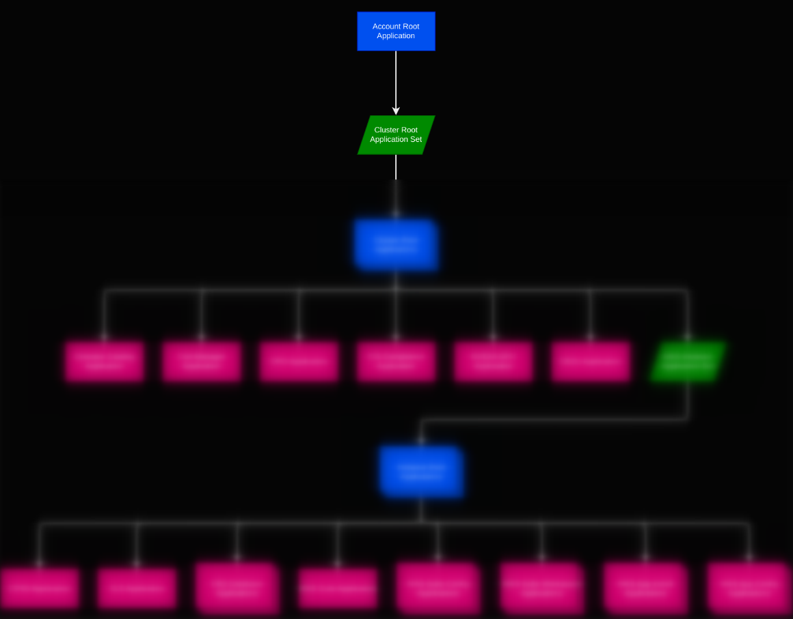
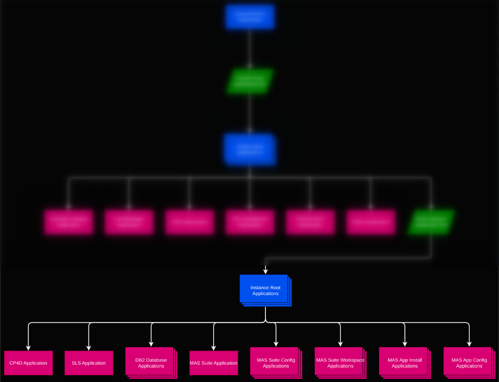

Generated Applications
===============================================================================

The following demonstrates how [ArgoCD Application Sets](https://argo-cd.readthedocs.io/en/stable/operator-manual/applicationset/) are combined with the [App of Apps pattern](https://argo-cd.readthedocs.io/en/stable/operator-manual/cluster-bootstrapping/#app-of-apps-pattern) to generate a tree of ArgoCD Applications that manage MAS instances in **Target Clusters** based on the configuration files in the **Config Repo**.

The Account Root Application
-------------------------------------------------------------------------------

It all begins with the **Account Root Application** . This is created directly on the cluster running ArgoCD. It serves as the "entrypoint" to the MAS Gitops Helm Charts and is where several key pieces of global configuration values are provided.



The manifest for the **Account Root Application** in our example is shown in the snippet below. The account ID, source repo, config (aka "generator") repo are configured here.

```yaml
apiVersion: argoproj.io/v1alpha1
kind: Application
metadata:
  name: root.dev
  namespace: openshift-gitops
spec:
  destination:
    namespace: openshift-gitops
    server: 'https://kubernetes.default.svc'
  project: "mas"
  source:
    path: root-applications/ibm-mas-account-root
    repoURL: https://github.com/ibm-mas/gitops
    targetRevision: master
    helm:
      values: |
        account:
          id: dev

        source:
          repo_url: "https://github.com/ibm-mas/gitops"
          revision: "mas"

        generator:
          repo_url: "https://github.com/me/my-config-repo"
          revision: "main"

        argo:
          namespace: "openshift-gitops"
```


The Cluster Root Application Set
-------------------------------------------------------------------------------

The **Cluster Root Application Set** employs a list of ArgoCD [Git File Generators](https://argo-cd.readthedocs.io/en/stable/operator-manual/applicationset/Generators-Git/#git-generator-files) to monitor for named YAML configuration files at the cluster level in the **Config Git Repo**. 


All cluster-level YAML configuration files contain a `merge-key`. The `merge-key` includes the Account and Cluster ID (e.g. `dev/cluster1`). The ArgoCD [Merge Generator](https://argo-cd.readthedocs.io/en/stable/operator-manual/applicationset/Generators-Merge/) groups the individual YAML files according to their `merge-key`, resulting in a combined YAML object for each target cluster that we want to manage MAS instances on. The `ibm-mas-cluster-base.yaml` file contains global configuration for the target cluster, and the other YAML configuration files represent one type of cluster-level application that we wish to install on the target cluster (e.g. `ibm-operator-catalog.yaml`, `ibm-dro.yaml`, `ibm-db2u.yaml`, and so on). For the sake of brevity we will only cover one of these (`ibm-operator-catalog.yaml`) here:

```yaml
spec:
  ...
  generators:
    - merge:
        mergeKeys:
          - 'merge-key'
        generators:
          - git:
              files:
              - path: "{{ .Values.account.id }}/*/ibm-mas-cluster-base.yaml"
          - git:
              files:
              - path: "{{ .Values.account.id }}/*/ibm-operator-catalog.yaml"
          ...
```

For example, if our **Git Config Repo** contains the following:

```
├── dev
│   ├── cluster1
│   │   ├── ibm-mas-cluster-base.yaml
|   |   |
|   |   |   merge-key: "dev/cluster1"
|   |   |   account:
|   |   |     id: dev
|   |   |   cluster:
|   |   |     id: cluster1
|   |   |     url: https://api.cluster1.cakv.p3.openshiftapps.com:443
|   |   |
│   │   ├── ibm-operator-catalog.yaml
|   |   |
|   |   |   merge-key: "dev/cluster1"
|   |   |   ibm_operator_catalog:
|   |   |      mas_catalog_version: v8-240430-amd64
|   |   |   
│   └── cluster2
│   │   ├── ibm-mas-cluster-base.yaml
|   |   |   
|   |   |   merge-key: "dev/cluster2"
|   |   |   account:
|   |   |      id: dev
|   |   |   cluster:
|   |   |     id: cluster2
|   |   |     url: https://api.cluster2.jsig.p3.openshiftapps.com:443
|   |   |   
│   │   ├── ibm-operator-catalog.yaml
|   |   |   
|   |   |   merge-key: "dev/cluster2"
|   |   |   ibm_operator_catalog:
|   |   |   mas_catalog_version: v8-240405-amd64
```


The **Cluster Root Application Set**  generators would produce two YAML objects:
```yaml
 merge-key: "dev/cluster1"
 account:
   id: dev
 cluster:
   id: cluster1
   url: https://api.cluster1.cakv.p3.openshiftapps.com:443
 ibm_operator_catalog:
   mas_catalog_version: v8-240430-amd64
```

```yaml
 merge-key: "dev/cluster2"
 account:
   id: dev
 cluster:
   id: cluster2
   url: https://api.cluster2.jsig.p3.openshiftapps.com:443
 ibm_operator_catalog:
   mas_catalog_version: v8-240405-amd64
```

Each YAML object is used to render the **Cluster Root Application Set** template:

```yaml
  template:
    metadata:
      name: "cluster.{{ `{{.cluster.id}}` }}"
      ...
    spec:
      source:
        path: root-applications/ibm-mas-cluster-root
        helm:
          values: "{{ `{{ toYaml . }}` }}"
```
[Go Template](https://argo-cd.readthedocs.io/en/stable/operator-manual/applicationset/GoTemplate/) expressions are used to inject values from the cluster's YAML object into the template. E.g. `.cluster.id` is either `cluster1` or `cluster2` and `{{ toYaml . }}` renders the cluster's YAML object in its entirety.

!!! info  "What are the backticks for?"

    Since the **Cluster Root Application Set** is itself a Helm template (rendered by the **Account Root Application**), we need to tell Helm to not attempt to parse the Go Template expressions and treat them as literals instead. This achieved by wrapping the go template expressions in backticks. The expressions in the snippet above will be rendered by Helm as `"cluster.{{.cluster.id}}"` and `"{{ toYaml . }}"`.
  
Additional global configuration parameters (such as details for the **Source Git Repo** and the namespace where ArgoCD is running) sourced from the **Account Root Application** are also passed down the Application tree as additional Helm parameters:
```yaml
            parameters:
              - name: "source.repo_url"
                value: "{{ .Values.source.repo_url }}"
              - name: "argo.namespace"
                value: "{{ .Values.argo.namespace }}"
```

The **Cluster Root Application** Helm Chart defines further ArgoCD Applications and so should be rendered into the cluster and namespace where ArgoCD is running. We specify the following:
```yaml
      destination:
        server: 'https://kubernetes.default.svc'
        namespace: {{ .Values.argo.namespace }}
```

Given the configuration in our example, two **Cluster Root Applications** are generated:

```yaml
kind: Application
metadata:
  name: cluster.cluster1
spec:
  source:
    path: root-applications/ibm-mas-cluster-root
    helm:
      values: |-
        merge-key: dev/cluster1`
        account:
          id: dev
        cluster:
          id: cluster1
          url: https://api.cluster1.cakv.p3.openshiftapps.com:443
        ibm_operator_catalog:
          mas_catalog_version: v8-240430-amd64
      parameters:
        - name: source.repo_url
          value: "https://github.com/..."
        - name: argo.namespace
          value: "openshift-gitops"
  destination:
    server: 'https://kubernetes.default.svc'
    namespace: openshift-gitops
```
```yaml
kind: Application
metadata:
  name: cluster.cluster2
spec:
  source:
    path: root-applications/ibm-mas-cluster-root
    helm:
      values: |-
        merge-key: dev/cluster2`
        account:
          id: dev
        cluster:
          id: cluster2
          url: https://api.cluster2.jsig.p3.openshiftapps.com:443
        ibm_operator_catalog:
          mas_catalog_version: v8-240405-amd64
      parameters:
        - name: source.repo_url
        - value: "https://github.com/..."
        - name: argo.namespace
          value: "openshift-gitops"
  destination:
    server: 'https://kubernetes.default.svc'
    namespace: openshift-gitops
```


The Cluster Root Application
-------------------------------------------------------------------------------

The **Cluster Root Application** Helm Chart contains templates to conditionally render ArgoCD Applications that deploy cluster-wide resources to **Target Clusters** once the configuration for the ArgoCD Application is present.


Application-specific configuration is held under a unique top-level field, e.g. `ibm_operator_catalog`, `ibm_db2u` and so on. If we look at the [000-ibm-operator-catalog-app template](root-applications/ibm-mas-cluster-root/templates/000-ibm-operator-catalog-app.yaml) for example, we can see it is guarded by:
```yaml
{{- if not (empty .Values.ibm_operator_catalog) }}
```
Following on from the example above, because `dev/cluster1/ibm-operator-catalog.yaml` has been pushed to the **Git Config Repo**, the `ibm_operator_catalog` key will appear in the Helm values passed to the  **Cluster Root Application**s. This will result in an ArgoCD Applications that will render the [ibm-operator-catalog Helm Chart](cluster-applications/000-ibm-operator-catalog) into each **Target Cluster**

Looking again at [000-ibm-operator-catalog-app template](root-applications/ibm-mas-cluster-root/templates/000-ibm-operator-catalog-app.yaml):

```yaml
kind: Application
metadata:
  name: operator-catalog.{{ .Values.cluster.id }}
spec:
  destination:
    server: {{ .Values.cluster.url }}
  source:
    path: cluster-applications/000-ibm-operator-catalog
    plugin:
      name: argocd-vault-plugin-helm
      env:
        - name: HELM_VALUES
          value: |
            mas_catalog_version: "{{ .Values.ibm_operator_catalog.mas_catalog_version  }}"
```


We can see it will generate an ArgoCD application named `operator-catalog.{{ .Values.cluster.id}}` (e.g. `operator-catalog.cluster1`, `operator-catalog.cluster2`). It will render the [ibm-operator-catalog Helm Chart](cluster-applications/000-ibm-operator-catalog) into the target cluster identified by the `.Values.cluster.url` value from the global cluster configuration in `ibm-mas-cluster-base.yaml`. In this case, we know some of the values will be [inline-path placeholders](https://argocd-vault-plugin.readthedocs.io/en/stable/howitworks/#inline-path-placeholders) for referencing secrets in the **Secrets Vault**, so we use the AVP plugin source to render the Helm chart.

Based on our example configuration, two **Cluster Root Application**s will be generated:

```yaml
kind: Application
metadata:
  name: operator-catalog.cluster1
spec:
  destination:
    server: https://api.cluster1.cakv.p3.openshiftapps.com:443
  source:
    path: cluster-applications/000-ibm-operator-catalog
    plugin:
      name: argocd-vault-plugin-helm
      env:
        - name: HELM_VALUES
          value: |
            mas_catalog_version: "v8-240430-amd64"
```

```yaml
kind: Application
metadata:
  name: operator-catalog.cluster2
spec:
  destination:
    server: https://api.cluster2.jsig.p3.openshiftapps.com:443
  source:
    path: cluster-applications/000-ibm-operator-catalog
    plugin:
      name: argocd-vault-plugin-helm
      env:
        - name: HELM_VALUES
          value: |
            mas_catalog_version: "v8-240405-amd64"
```


The other Application templates (e.g. [010-ibm-redhat-cert-manager-app.yaml](root-applications/ibm-mas-cluster-root/templates/010-ibm-redhat-cert-manager-app.yaml), [020-ibm-dro-app.yaml](root-applications/ibm-mas-cluster-root/templates/020-ibm-dro-app.yaml) and so on) all follow this pattern and work in a similar way.

The **Cluster Root Application** chart also includes the [099-instance-appset.yaml](root-applications/ibm-mas-cluster-root/templates/099-instance-appset.yaml) which generates a new **Instance Root Application Set** for each cluster.

The Instance Root Application Set
-------------------------------------------------------------------------------

The [Instance Root Application Set](root-applications/ibm-mas-cluster-root/templates/099-instance-appset.yaml) is responsible for generating an **Instance Root Application** per MAS instance on **Target Cluster**s. 


It follows the same pattern as the Cluster Root Application Set described [above](#the-cluster-root-application-set). The key differences are:

- `merge-keys` in the instance-level configuation YAML files also contain a MAS instance ID, e.g. `dev/cluster1/instance1`.
- The generated **Instance Root Applications** source the [ibm-mas-instance-root Helm Chart](root-applications/ibm-mas-instance-root).
- The Git File generators look for a different set of named YAML files at the **instance** level in the **Config Git Repo**:

```yaml
spec:
  ...
  generators:
    - merge:
        mergeKeys:
          - 'merge-key'
        generators:
          - git:
              files:
              - path: "{{ .Values.account.id }}/{{ .Values.cluster.id }}/*/ibm-mas-instance-base.yaml"
          - git:
              files:
              - path: "{{ .Values.account.id }}/{{ .Values.cluster.id }}/*/ibm-mas-suite.yaml"
```


To continue our example above, our **Git Config Repo** now contains some additional instance-level config files (only showing `cluster1` this time for brevity):

```
├── dev
│   ├── cluster1
│   │   ├── ibm-mas-cluster-base.yaml
|   |   |
│   │   ├── ibm-operator-catalog.yaml
|   |   |
│   |   ├── instance1
│   |   │   ├── ibm-mas-instance-base.yaml
|   |   |   |
|   |   |   |   merge-key: "dev/cluster1/instance1"
|   |   |   |   account:
|   |   |   |     id: dev
|   |   |   |   cluster:
|   |   |   |     id: cluster1
|   |   |   |     url: https://api.cluster1.cakv.p3.openshiftapps.com:443
|   |   |   |   instance:
|   |   |   |     id: instance1
|   |   |   |
│   |   │   ├── ibm-mas-suite.yaml
|   |   |   |  
|   |   |   |   merge-key: "dev/cluster1/instance1"
|   |   |   |   ibm_mas_suite:
|   |   |   |     mas_channel: "8.11.x"
...
```

The **Instance Root Application Set** generators would produce a YAML object:
```yaml
merge-key: "dev/cluster1/instance1"
account:
  id: dev
cluster:
  id: cluster1
  url: https://api.cluster1.cakv.p3.openshiftapps.com:443
instance:
  id: instance1
ibm_mas_suite:
  mas_channel: "8.11.x"
```

This would be used to render the **Instance Root Application Set** template and generate an **Instance Root Application**:
```yaml
kind: Application
metadata:
  name: instance.cluster1.instance1
spec:
  source:
    path: root-applications/ibm-mas-instance-root
    helm:
      values: |-
        merge-key: dev/cluster1/instance1
        account:
          id: dev
        cluster:
          id: cluster1
          url: https://api.cluster1.cakv.p3.openshiftapps.com:443
        instance:
          id: instance1
        ibm_mas_suite:
          mas_channel: "8.11.x"
      parameters:
        - name: source.repo_url
          value: "https://github.com/..."
        - name: argo.namespace
          value: "openshift-gitops"
  destination:
    server: 'https://kubernetes.default.svc'
    namespace: openshift-gitops
```

The Instance Root Application
-------------------------------------------------------------------------------

The **Instance Root Application** Helm chart contains templates to conditionally render ArgoCD Applications that deploy MAS instances to **Target Clusters** once the configuration for the ArgoCD Application is present.



It follows the same pattern as the **Cluster Root Application** described [above](#the-cluster-root-application); specific applications are enabled once their configuration becomes present. For instance, the [130-ibm-mas-suite-app.yaml](root-applications/ibm-mas-instance-root/templates/130-ibm-mas-suite-app.yaml) template generates an Application that deploys the MAS `Suite` CR to the target cluster once configuration under the `ibm_mas_suite` key is present.

Some special templates are capable of generating multiple applications: [120-db2-databases-app.yaml](root-applications/ibm-mas-instance-root/templates/120-db2-databases-app.yaml), [130-ibm-mas-suite-configs-app.yaml)](root-applications/ibm-mas-instance-root/templates/130-ibm-mas-suite-configs-app.yaml), [200-ibm-mas-workspaces.yaml](root-applications/ibm-mas-instance-root/templates/200-ibm-mas-workspaces.yaml) and [130-ibm-mas-suite-configs-app.yaml](root-applications/ibm-mas-instance-root/templates/130-ibm-mas-suite-configs-app.yaml). These are special cases where there can be more than one instance of the *type* of resource that these Applications are responsible for managing. 

For example, the MAS instance may require more than one DB2 Database. To accommodate this, we make use of the Helm `range` control structure to iterate over a YAML list in template for DB2 Database Applications [120-db2-databases-app.yaml](root-applications/ibm-mas-instance-root/templates/120-db2-databases-app.yaml):
```yaml
{{- range $i, $value := .Values.ibm_db2u_databases }}
---
apiVersion: argoproj.io/v1alpha1
kind: Application
metadata:
  name: "db2-db.{{ $.Values.cluster.id }}.{{ $.Values.instance.id }}.{{ $value.mas_application_id }}"
...
{{- end}}
```

This iterates over the list held in the `ibm-db2u-databases.yaml` configuration file to generate any number of DB2 Database Applications configured as needed.
```yaml
ibm_db2u_databases:
  - mas_application_id: iot
    db2_memory_limits: 12Gi
    ...
  - mas_application_id: manage
    db2_memory_limits: 16Gi
    db2_database_db_config:
      CHNGPGS_THRESH: '40'
      ...
    ...
```

!!! info "Why not use ApplicationSets here?"
 
    We encountered some limitations when using ApplicationSets for this purpose. For instance, Applications generated by ApplicationSets do not participate in the [ArgoCD syncwave](https://argo-cd.readthedocs.io/en/stable/user-guide/sync-waves/) with other Applications so we would have no way of ensuring that resources would be configured in the correct order. By using the Helm `range` control structure we generate "normal" Applications that do not suffer from this limitation. This means, for instance, that we can ensure that DB2 Databases are configured **before** attempting to provide the corresponding JDBC configuration to MAS.
